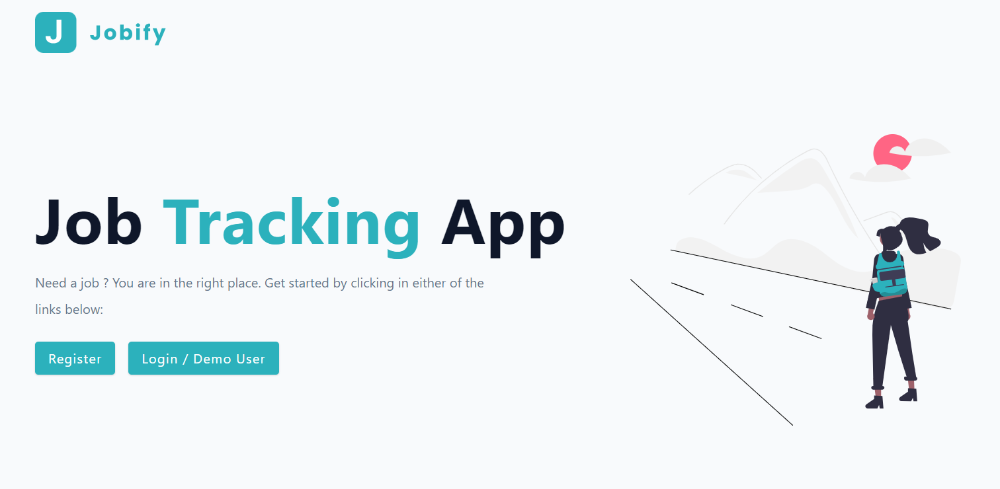

# Jobify - MERN Stack App

Jobify is a sophisticated web application crafted with the MERN (MongoDB, Express.js, React, Node.js) stack. It serves as a comprehensive platform for job seekers, facilitating the seamless discovery and application process for enticing job opportunities.

## Demo



- 

## Table of Contents

- [Jobify - MERN Stack App](#jobify---mern-stack-app)
  - [Demo](#demo)
  - [Table of Contents](#table-of-contents)
  - [Features](#features)
  - [Technologies Used](#technologies-used)
  - [Prerequisites](#prerequisites)
  - [Installation](#installation)
    - [Frontend](#frontend)
    - [Backend](#backend)
  - [Contributing](#contributing)

## Features

- **User Authentication and Authorization**: Secure access control and user identity verification.
- **Job Listing and Searching**: Effortless exploration of available job opportunities.
- **Job Application and Tracking**: Streamlined application process with efficient tracking mechanisms.
- **User Profile Management**: Personalized user profiles for enhanced customization.
- **Admin Dashboard**: Comprehensive dashboard for administrators to manage jobs and users effectively.

## Technologies Used

- **MongoDB**: A robust NoSQL database for efficient data storage.

- **Express.js (Backend)**: A minimalist and flexible Node.js web application framework.


- **Node.js (Runtime for Backend)**: A powerful JavaScript runtime for server-side development.


- **React.js (Frontend)**: A declarative and efficient JavaScript library for building user interfaces.


## Prerequisites

Ensure the following prerequisites are installed before running the application:

- **Node.js and npm**
- **MongoDB**

## Installation

1. **Clone the Repository:**

```bash
git clone https://github.com/preston176/jobify.git
cd jobify
```

2. **Install Dependencies:**

```bash
npm install
```

### Frontend

Navigate to the `client` directory and install frontend dependencies:

```bash
cd client
npm install
```

### Backend

Update the `.env` file with your backend configuration:

```env
NODE_ENV=development
PORT=5100
MONGO_URL=YOUR_MONGO_DB_CONNECTION_URL
JWT_SECRET=YOUR_SECRET_KEY
JWT_LIFETIME=1d
JWT_EXPIRES_IN=1h
```

Replace `YOUR_MONGO_DB_CONNECTION_URL` and `YOUR_SECRET_KEY` with your MongoDB connection URL and a secure JWT secret key, respectively.

3. **Run the Application:**

- Inside the `client` folder:

```bash
npm run dev
```

- Inside the `jobify` directory:

```bash
npm run dev
```

- For the backend:

```bash
npm start
```

## Contributing

- Feel Free to contribute by raising issues and opening PRs ☺️